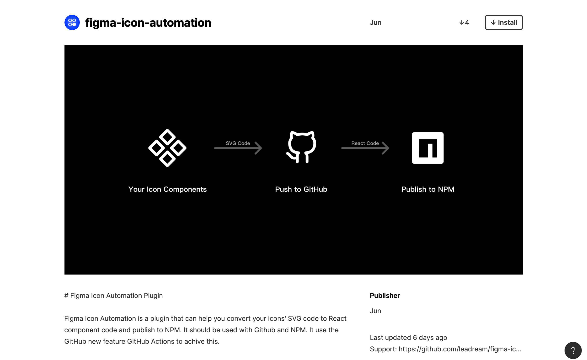
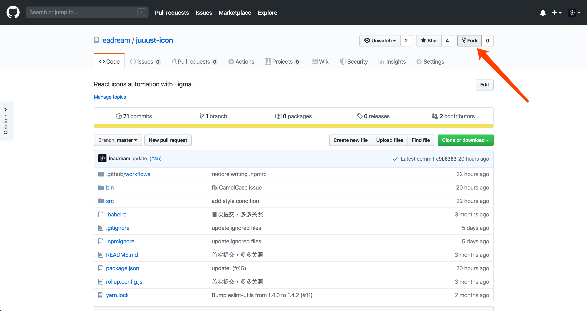
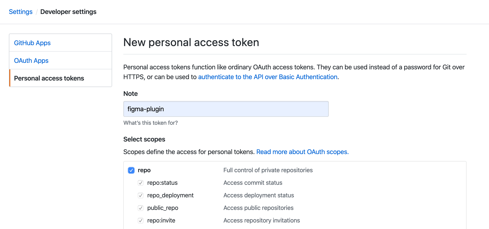
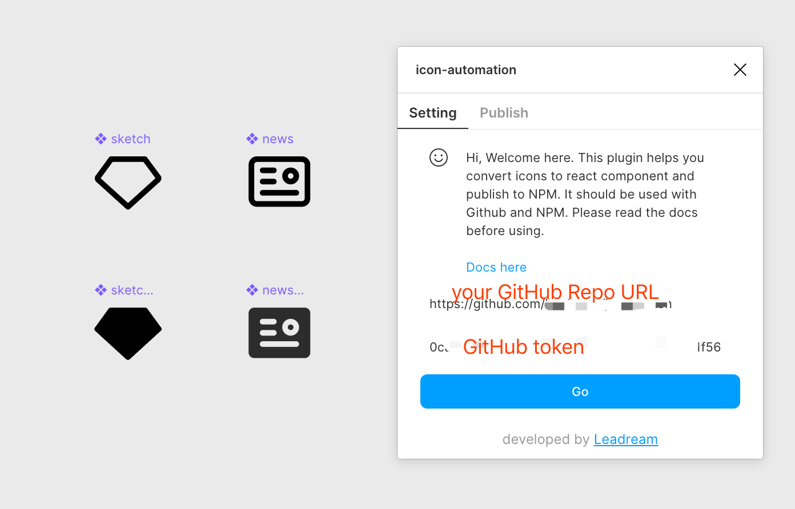
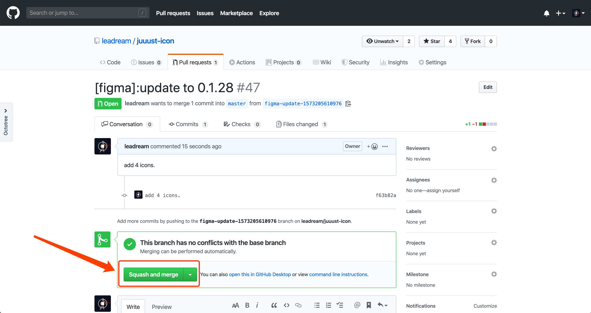
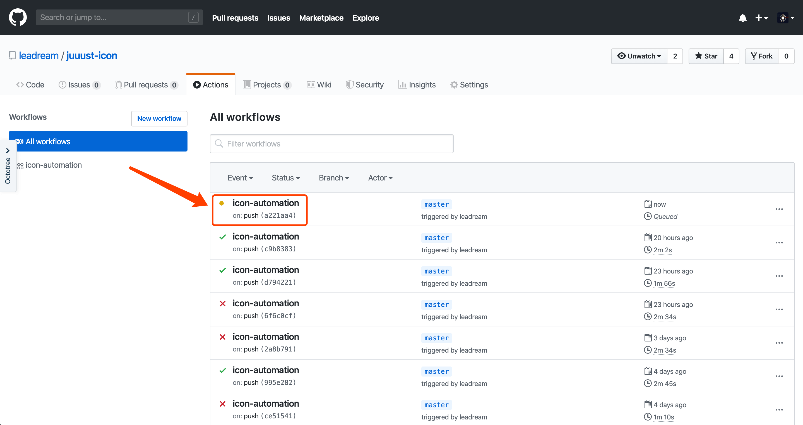
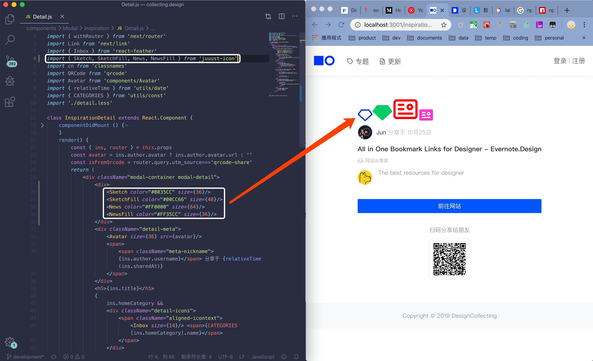

# Figma 图标自动化插件
[English](./README.md)

>第一次配置过程比较繁琐，且需要一定的开发知识，可以邀请开发同学一起完成。

Figma 图标自动化插件是一个可以帮助你将设计文件中的图标组件转换为 React 组件代码，并上传至 NPM 以便开发直接使用命令行安装和更新的插件。设计师可以通过此插件快速交付图标文件，它能省去很多不必要的中间环节，从而达到让设计师轻轻一点就更新，开发一条命令就下载的效果，**整个过程中两人都不用离开座位多说一句话**。

本项目灵感来源于 [GitHub Octicon](https://github.com/primer/octicons) 和 [Feather Icon](https://github.com/feathericons/react-feather)，感谢这两个很棒的图标库。感兴趣的朋友可以了解一下 [GitHub 怎样使用 Figma API 来交付图标的](https://github.blog/2018-04-12-driving-changes-from-designs/)。

## 它是怎样工作的？

整个流程比较复杂，但大部分都是自动化的，只需要一次配置，后续使用都非常简单。整个过程大致可以分为六步：
- **创建组件**：
首先，设计师应该创建一个 Figma 文件，并在里面来设计所有的图标。需要注意的是，最后要将图标转换为组件，因为整个过程只会转换组件。
- **插件生成 Pull Request**：安装好插件之后，填写自己对应的 GitHub 仓库信息，每次更新之后通过插件来发布版本更新，这会在你的仓库中生成一个 Pull Request，也就是一个合并请求。
- **合并 PR，触发 Actions**：前往 GitHub 页面，将这个 PR 合并至主分支，这会触发仓库内定义好的一连串 [GitHub Actions](https://github.com/features/actions)（GitHub 的自动化流程）。
- **处理转换 SVG 代码**：这一连串 GitHub Actions 会做这么几件事：首先它会通过 Figma API 自动获取组件的 SVG 代码，接着将 SVG 代码中的冗余代码移除，再将其转换为 React 组件格式的代码。
- **生成 GitHub Pages 来展示图标**: GitHub Actions 还会生成 GitHub Pages 代码来展示你的图标，你可以在示例仓库中修改这些代码。
- **发布至 NPM**：[NPM](https://www.npmjs.com/) 是一个前端的包管理工具，你可以将你的组件库上传至它的云端存储中，这样开发同学就可以使用熟悉的命令行安装使用或者更新了。上述 Actions 的最后一步就是将生成的图标组件库上传至 NPM。
- **开发安装或更新**：一般前端都会使用 NPM 来管理自己项目中的依赖库，上述步骤完成后他们就可以通过执行命令来安装或者更新图标库了，并在代码中直接引入使用了。

## 如何使用
### 先决条件
- 首先，你需要有一个 [GitHub](https://github.com) 账号。
- 其次，你还需要有一个 [NPM](https://www.npmjs.com) 账号。

如果你还没有的话，只需要去对应的官网注册就可以了，注册过程此处按下不表。

### 使用步骤
#### 1. 创建 Figma 文件
首先你需要创建一个 Figma 文件，在里面存放你的图标组件，你可以从我的[示例文件](https://www.figma.com/file/gTaV6nOPiDx0F3c7WHPME3/juuust-icon)复制，也可以自己创建一个文件，不过图标要转为 master 组件。

#### 2. 安装插件
进入 [figma-icon-automation 插件主页](https://www.figma.com/c/plugin/739395588962138807/figma-icon-automation)，点击安装即可。

#### 3. fork demo 仓库
现在你需要 fork 我的示例仓库，有 React 和 Vue 两种技术栈，选择你需要的然后点击右上角的 fork 就可以把这个仓库复制到自己的账号下。

- React: https://github.com/leadream/juuust-react-icon
- Vue: https://github.com/leadream/juuust-vue-icon

#### 4. 生成三个 token
我们需要 Figma、GitHub 和 NPM 三个平台的 token。
- **Figma**：打开 Figma 的个人设置页面，创建一个新的 token，复制下来备用（只会显示这一次，一刷新就没了）。

- **GitHub**：打开 [GitHub token](https://github.com/settings/tokens) 页面，生成一个 token，复制下来备用。**此处需要注意，记得要勾选下面的 repo scope**。

- **NPM**：前往 NPM 的个人 token 页面，生成一个 token，复制下来备用。

#### 5. 填写三个 Secrets
进入 GitHub 的仓库下 Settings -> Secrets 页面中，添加三个 Secret。它们分别是：
- **FIGMA_FILE_URL**：第一步创建的 Figma 文件地址。
- **FIGMA_TOKEN**：上一步创建的 Figma token。
- **NPM_AUTH_TOKEN**：上一步创建的 NPM token。

#### 6. 在插件中填写仓库地址和 token
打开 Figma，右键依次选择 Plugins -> Development -> icon-automation，打开插件，此时我们需要填写两个东西。第一个是填写第三步 fork 到你的账号下的仓库地址（是你自己的仓库地址，不要填写我的 demo 的地址）。同时填写第四步中生成的 GitHub token，点击 go 之后插件会进入到发布页面。此时我们先不提交，一会还会回来的。

#### 7. 更改仓库信息
在发布之前，你需要更新一下仓库中 package.json 中的一些信息，首先是 name，改成一个你自己喜欢的名字。name 要求只能使用小写字母、中划线或下划线组合，你还可以按照 @your-name/package-name 的形式命名。其次是 version，把它改成 0.0.0 就可以了。

还有一些比如 description、repository、author 等等都可以改成你自己的信息。

#### 8. 在插件中填写版本号，发布更新
此时我们打开 Figma 客户端，填写一个版本号，并填写自己的修改信息，然后点击 push to GitHub，等待完成。

发布成功，这一步会在你的仓库中创建一个 PR，点击成功提示中的链接就可以打开这个 PR 页面。

#### 9. 合并 PR，等待 Actions 执行完毕
在 PR 页面，我们点击合并按钮，将这个 PR 合并至主仓库。

这个操作会触发 GitHub Actions，进入 Actions 页面可以看到正在逐步执行定义好的流程。

点击进去可以看到具体每一步执行的情况。

#### 10. 执行完毕，开发在命令行安装、更新
等 GitHub Actions 的每一步都完成之后，开发就可以在终端执行 `npm add YOUR_PACKAGE_NAME` 来安装这个组件库了，如果已经安装，只需要执行 `npm update YOUR_PACKAGE_NAME` 来更新就可以了。

如果使用的是 yarn，则需要执行 `yarn add YOUR_PACKAGE_NAME` 来安装或执行 `yarn upgrade YOUR_PACKAGE_NAME` 来更新。

接着，他就可以在 React 项目代码中引入组件库并使用了。

## 注意事项
- 图标一般有描边（stroke）和填充（fill）两种样式，一个图标只能采用一种形式，不可以混合。想要转为 fill 样式，你可以使用 Outline Stroke 将图标转换为填充形状。
- 图标命名请使用英文（不可以含 `/`），因为这些命名最终会变为代码中的命名。同时，你可以通过给命名添加 `-fill` 或 `-stroke` 后缀来区别它们的样式，GitHub Actions 会根据这个后缀生成对应的代码。
- 请记得更改 package.json 中的 name 和 version。
- **很多过程需要开发知识，可以邀请开发同学协助完成。**
