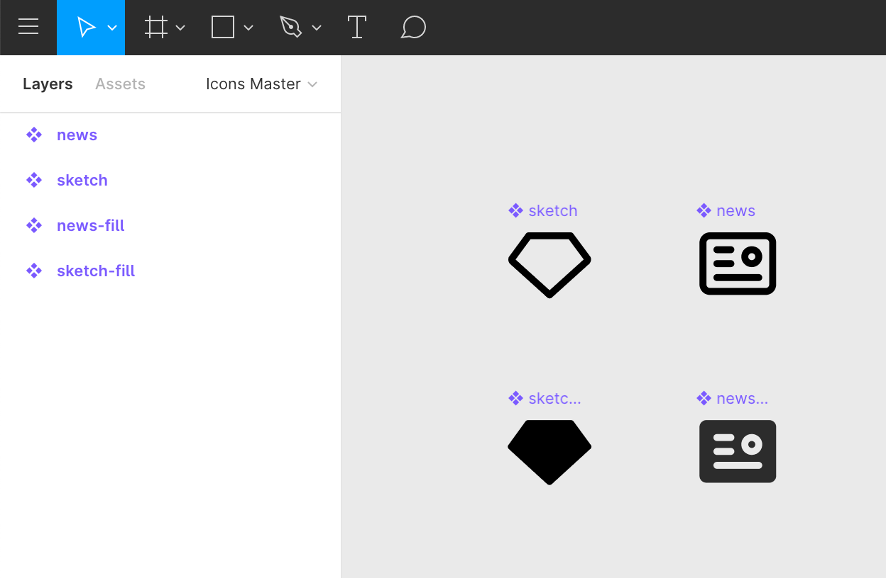
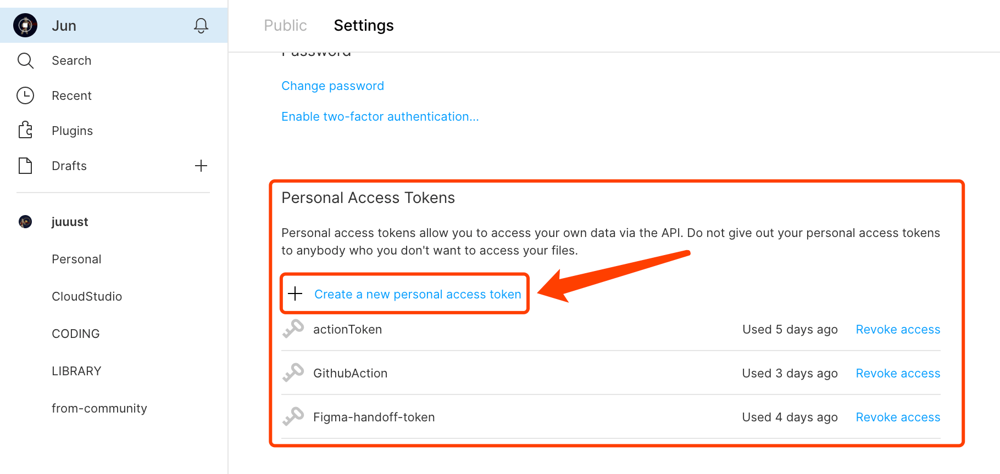
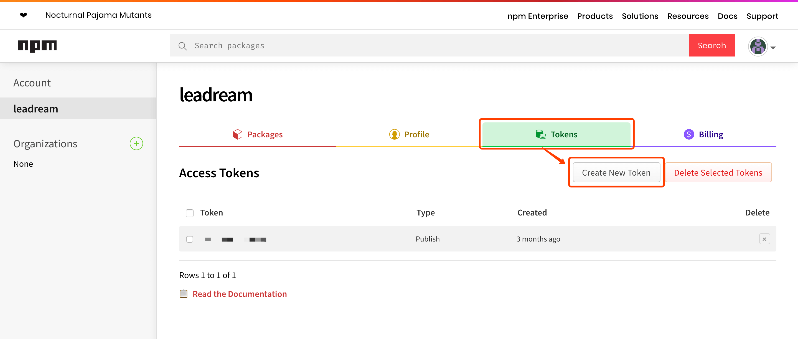
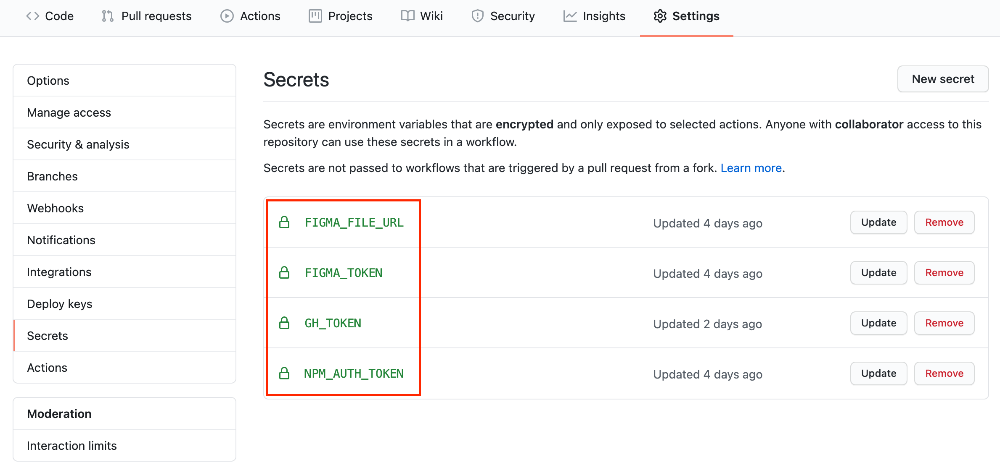
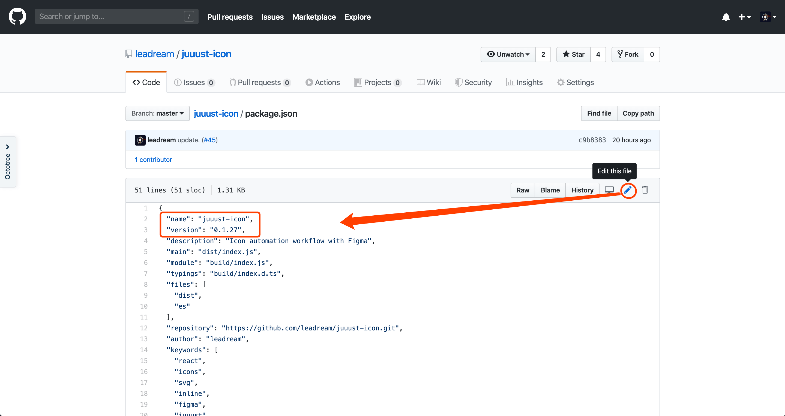
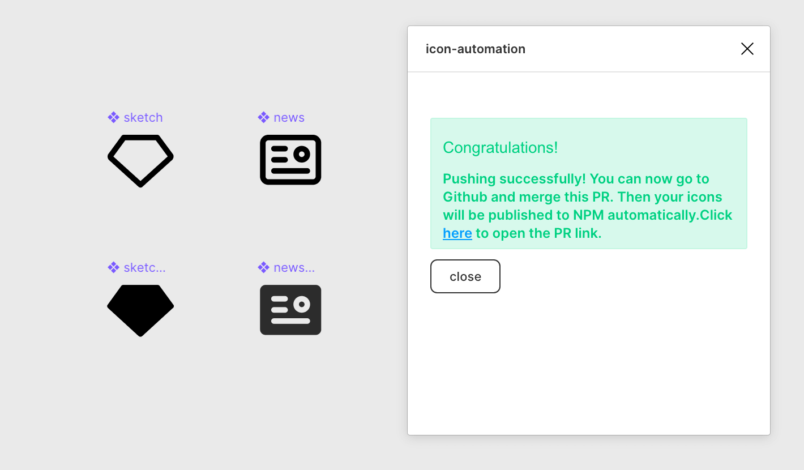
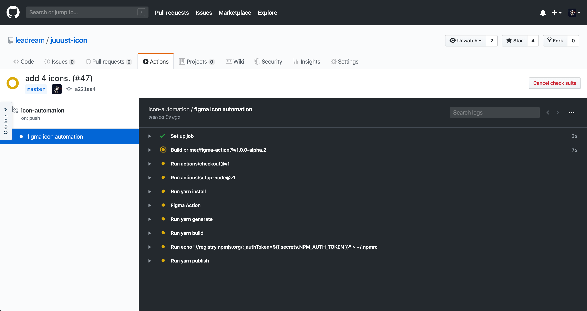
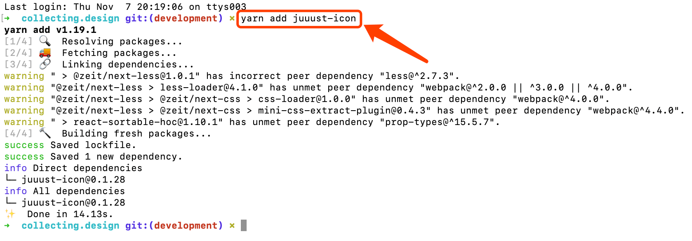

# Figma Icon Automation Plugin
[中文说明](./README-CN.md)

Figma Icon Automation is a plugin that can help you convert your icons' SVG code to React component code and publish to NPM. It should be used with Github and NPM. It use the GitHub new feature [GitHub Actions](https://github.com/features/actions) to achive this.

This project is inspired by [GitHub Octicon](https://github.com/primer/octicons) and [Feather Icon](https://github.com/feathericons/react-feather). Thanks for these two amazing repository. Also, you can learn more about [how GitHub use Figma's API to handoff octicon](https://github.blog/2018-04-12-driving-changes-from-designs/).

## How it works?

This workflow is a bit complex, but most can run itself automatically. You only need to configure it once and enjoy many times later.

There are six steps here:

- **Create Components**: At first, you should create a file which contains your icons' components (this workflow only fetch components).
- **Create Pull Request in Plugin**: Fill in the GitHub repository URL and token to push your updates to GitHub, which can create a Pull Request for you.
- **Merge PR, Trigger Actions**: Now you can merge this PR, which will trigger the GitHub Actions workflow.
- **Process and Convert SVG code**: GitHub Actions will fetch Figma components's SVG code through Figma's API and process it. After it, GitHub Actions will convert them into React component code.
- **Generate GitHub Pages for icon showcase**: GitHub Actions will also generate GitHub Pages code to showcase your icons online. You can change the code in sample repositories.
- **Publish to NPM**: Finally, it'll publish processed code to [NPM](https://www.npmjs.com/). 
- **install or update from NPM**: Developers can use them through terminal execution, which is familiar to them.

## Usage
### Pre-requirements
- At first, you need a GitHub account.
- Then, you need a NPM account.

### Steps
#### 1. Create Figma File
First of all, you should create a Figma file, in which you can place your icon components. Here is an [example file](https://www.figma.com/file/gTaV6nOPiDx0F3c7WHPME3/juuust-icon). You can duplicate it to your account.

#### 2. Install Plugin
Go to [figma-icon-automation](https://www.figma.com/c/plugin/739395588962138807/figma-icon-automation) homepage and click install button.

#### 3. Fork Example Repository
Now you should fork my sample repositories, which is a place for your components' code.

- React: https://github.com/leadream/juuust-react-icon
- Vue: https://github.com/leadream/juuust-vue-icon

#### 4. Generate Three Tokens
We need Figma、GitHub and NPM's tokens for the rest steps。
- **Figma**: Open your personal settings page, find token section, create a new token. Copy it to use later.

- **GitHub**: Open [GitHub token](https://github.com/settings/tokens) page and generate a new token and copy it to use later. **One thing to note is that You should check the repo scope**.

- **NPM**: Go to your NPM profile page, find tokens section. Generate a new token and copy it to user later.

#### 5. Set 3 Secrets

The GitHub needs 3 secrets, which you can set in Settings -> Secrets page.
- **FIGMA_FILE_URL**: The Figma file URL in the first step.
- **FIGMA_TOKEN**: Figma token created in previous step.
- **NPM_AUTH_TOKEN**: NPM token created in previous step.

#### 6. Setup the Plugin
Open Figma, right click in canvas and select Plugins -> icon-automation. You should fill in the repository URL (it's your forked repository, not example repository) and GitHub token, then click go button. Don't push now, we'll be back later.

#### 7. Update Your Repository's Package.json
Before publishing, you need to update the `package.json` file.
- update name, you can use scoped name, such as `@your-name/package-name`
- update version, 0.0.0 is perfect at begin.

Also you can update description, repository, author to your own information.

#### 8. Fill in Version and Commit Message, Publish it
Now we can open the plugin, fill in your new version and update message, then push it to GitHub.

It will create a PR in your repository when published successfully. You can open the PR page be clicking the link in the success message.

#### 9. Merge the PR and Wait for Actions Completed
In the PR page, click the merge button, which will merge it into master branch.

This operation will trigger GitHub Actions. We can see the workflow is running in Actions page.

Click it to get more detailed information about every step.

#### 10. Completed, Install or Upgrade the Package in Termianl
Developers can run `npm add YOUR_PACKAGE_NAME` in terminal to install the package, or run `npm update YOUR_PACKAGE_NAME` to upgrade the package.

Instead, they can also run `yarn add YOUR_PACKAGE_NAME` or `yarn upgrade YOUR_PACKAGE_NAME` if yarn is used.

The magic moment is coming! Developers can import these icons into their react project and it works.

## Attentions
- We have two icon styles, stroke and fill. Please make sure each icon only conatins one style, don't mix them (Tip: you can use Figma's Outline Stroke to convert stroked icon into filled icon).
- Icons with suffix `-fill` will be converted into filled component code, and the one with suffix `-stroke` will be converted into stroked component code.
- Default style is defined in `config.style` in `package.json`.
- Components' name can't include slash (`/`).
- Please make sure you've updated name and version in `package.json`.
- Setting it up with a front-end developer maybe is better.
